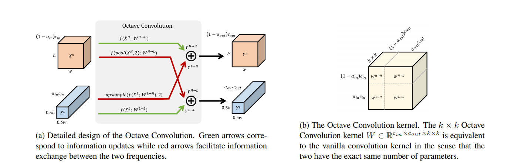

# OctaveConvolution
A Gluon Implementation for Drop an Octave

## Usage
- Oct_Resnet V1/V2 is supported.
- Oct_ResNext is supported.

## Result

|Model         |alpha|epochs|batch size|dtype  |tricks         |Top1|Top5|
|:------------:|:---:|:----:|:--------:|:-----:|:-------------:|:--:|:--:|
|oct_resnet50v2|0.125|120   |128       |float16|mixup,no bias decay,cosine decay,label_smoothing|Training|-|


## Todo
- [ ] mobilenet V2 implement.
- [ ] SE_layer support.
- [ ] ResidualAttention support.

## Paper Reference

[Drop an Octave: Reducing Spatial Redundancy in 
Convolutional Neural Networks with Octave Convolution](https://export.arxiv.org/pdf/1904.05049)




## Acknowledgment
The [train_script](train_script.py) refers to [Gluon-cv](https://github.com/dmlc/gluon-cv).

```
@article{he2018bag,
  title={Bag of Tricks for Image Classification with Convolutional Neural Networks},
  author={He, Tong and Zhang, Zhi and Zhang, Hang and Zhang, Zhongyue and Xie, Junyuan and Li, Mu},
  journal={arXiv preprint arXiv:1812.01187},
  year={2018}
}
```